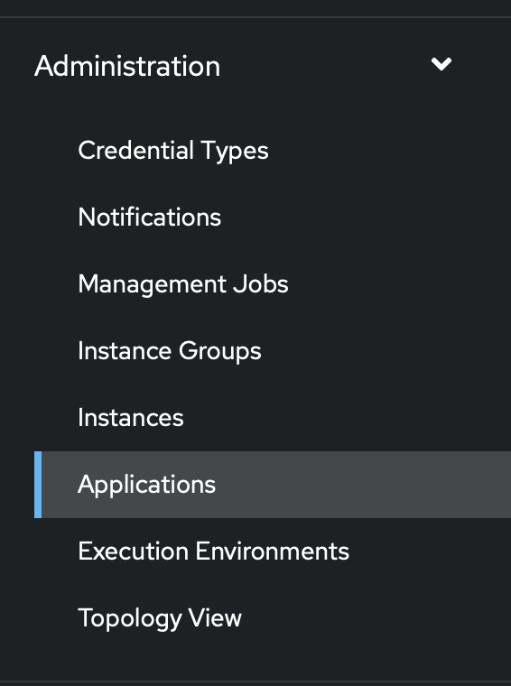

# Overview

When setting up your Lightspeed service, you will need to configure the integrations with Ansible Automation Platform and IBM watsonx Code Assistant.

## Integrating with Ansible Automation Platform

Lightspeed service depends on a deployed instance of Ansible Automation Platform (AAP).  The following steps decribe how you can configure it.

### Create An Application in AAP

* Login to your AAP
* In the left hand side navigation menu, click `Administration/Application`

  
  
* Click `Add` to create a new application
* Fill in the application details. This is an example
  
  
  * Note that you won't have the exact `Redirect URIs` yet. For now, just enter a valid URL and we will come back to update it after installation of Lightspeed.
  * After clicking `Save`, a pop up with `Client ID` and `Client secret` will show up.
  * Copy the `Client secret` and store it in a secured storage (e.g. secrets vault) because you will not be able to retrieve it after dismissing the popup.
* Now you will have collected the following
  * The application `Client ID` 
  * The application `Client secret` 
  * The AAP API URL which is normally `<aap_web_url>/api/`

### When instantiating Ansible Lightspeed CR

When you instantiate an Ansible Lightspeed Custom Resource in the OpenShift cluster, the 3 pieces of information collected from the above will help you fill
1. `AAP authentication key`: The application `Client ID`
2. `AAP authentication secret`: The application `Client secret`
3. `AAP API URL`: The AAP API URL `<aap_web_url>/api/`

You can also use an existing `Secret` to store these _sensitive_ values. See [here](using-external-configuration-secrets.md#authentication-secret) for instructions.

### After Ansible Lightspeed CR is created

* A route to the Lightspeed API service will be provisioned in the namespace
* Revisit the application object you have created in the [Create An Application in AAP](create-an-application-in-aap) section
* Update the `Redirect URIs` field with `<lightspeed_route>/complete/aap/` where `<lightspeed_route>` is the route you just obtained.

## Integrating with IBM watsonx Code Assistant

Currently, IBM watsonx Code Assistant can be delivered through a cloud verson and a on-premise verion, the Cloud Pack for Data.  Lightspeed service can integrate with either of them.

When you instantiate an Ansible Lightspeed Custom Resource in the OpenShift cluster, there is a config section `ai`.  Near the end of the section, click open the `Advanced configuration` and choose the `Type of AI provider`.  Choose `wca-onprem` to integrate with the Cloud Pack for Data that you have set up in your infrastructure.  Choose `wca` to integrate with the cloud version.

### IBM watsonx Code Assistant - Cloud Pack for Data (CPD)

You will need to fill in these information:

1. `AI provider endpoint`: The URL to your Cloud Pack for Data instance 
2. `AI provider API Key`: [Cloud Pack for Data API key](https://www.ibm.com/docs/en/cloud-paks/cp-data/4.8.x?topic=steps-generating-api-keys) 
3. `AI provider Model Name`: An e.g.: `8e7de79b-8bc2-43cc-9d20-c4207cd92fec<|sepofid|>granite-3b`
4. `AI provider username`: The username that has access to the model/space

You can also use an existing `Secret` to store these _sensitive_ values. See [here](using-external-configuration-secrets.md#model-service-secret) for instructions.

### IBM watsonx Code Assistant - IBM Cloud

You will need to fill in these information:

1. `AI provider endpoint`: The URL to IBM Cloud `https://dataplatform.cloud.ibm.com`
2. `AI provider API Key`: API key obtained from your IBM Cloud account
3. `AI provider Model Name`: An e.g.: `8e7de79b-8bc2-43cc-9d20-c4207cd92fec<|sepofid|>granite-3b`

You can also use an existing `Secret` to store these _sensitive_ values. See [here](using-external-configuration-secrets.md#model-service-secret) for instructions.
