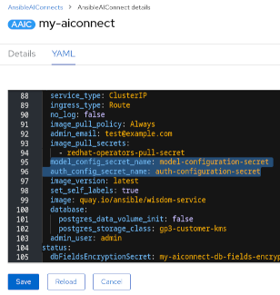

# Using external configuration `Secret`'s

## Overview

Configuration parameters for the both the authentication backend and model service **must** be provided using `Secret`'s.

## Authentication `Secret`

`spec.auth_config_secret_name` should be set to the name of an existing `Secret`. The Operator will use the values set therein to configure the authentication backend integration. The `Secret` must contain the following values:
```yaml
apiVersion: v1
kind: Secret
metadata:
  name: <secret-name>-auth-configuration
  namespace: <target-namespace>
stringData:
  auth_api_url: <Authentication service URL>
  auth_api_key: <Authentication service API Key>
  auth_api_secret: <Authentication service API Secret>
  auth_verify_ssl: <boolean>
  auth_allowed_hosts: <domains>
type: Opaque
```
Set `auth_verify_ssl` to pass the `verify` parameter to HTTP requests made by the service. A value of `True` is recommended for use in production. See [here](https://python-social-auth.readthedocs.io/en/latest/configuration/settings.html#processing-requests-and-redirects) for details.

`auth_allowed_hosts` contains a list of strings representing the host/domain names that this service can serve. A wildcard `*` can be used to grant access to all hosts sending requests to the service however this is not recommended nor encouraged for production. See [here](https://docs.djangoproject.com/en/5.0/ref/settings/#allowed-hosts) for details.

The `AnsibleAIConnect` configuration would look like this:
```yaml
apiVersion: aiconnect.ansible.com/v1alpha1
kind: AnsibleAIConnect
metadata:
  name: <instance-name>
  namespace: <target-namespace>
spec:
  ...
  auth_config_secret_name: <secret-name>-auth-configuration
```

## Model service `Secret`

`spec.model_config_secret_name` should be set to the name of an existing `Secret`. The Operator will use the values set there in to configure the model service integration. The `Secret` must contain the following values:
```yaml
apiVersion: v1
kind: Secret
metadata:
  name: <secret-name>-model-configuration
  namespace: <target-namespace>
stringData:
  username: <WCA "on prem" username[1]>
  model_url: <WCA service URL>
  model_api_key: <WCA API Key>
  model_id: <WCA Model Id>
  model_type: <WCA type[2]>
  model_verify_ssl: <BOOL [3]>
  model_enable_anonymization: <BOOL [4]>
type: Opaque
```
- [1] `username` is only required for `wca-onprem`. The value is discarded for `wca`.
- [2] `model_type` is either `wca` or `wca-onprem`.
- [3] `model_verify_ssl` is optional and defaults to True. Changing this value is discouraged.
- [4] `model_enable_anonymization` is optional and defaults to True. Changing this value to disable the PII anonymization layer.

The `AnsibleAIConnect` configuration would look like this:
```yaml
apiVersion: aiconnect.ansible.com/v1alpha1
kind: AnsibleAIConnect
metadata:
  name: <instance-name>
  namespace: <target-namespace>
spec:
  ...
  model_config_secret_name: <secret-name>-model-configuration
```

## Chatbot service `Secret`

`chatbot_config_secret_name` should be set to the name of an existing `Secret`. The Operator will use the values set therein to configure the chatbot service integration.
The `Secret` would look like this:

```yaml
apiVersion: v1
kind: Secret
metadata:
  name: <secret-name>-chatbot-configuration
  namespace: <target-namespace>
stringData:
  chatbot_url: <Chatbot LLM URL>
  chatbot_model: <Chatbot model name>
  chatbot_token: <Chatbot LLM access token>
  aap_gateway_url: <AAP Gateway URL>
  aap_controller_url: <AAP Controller URL>
type: Opaque
```
**Required Parameters**

* `chatbot_url`
* `chatbot_model`
* `chatbot_token`

**Parameter combinations**

Providing `aap_gateway_url` and/or `aap_controller_url` affect how the Chatbot is provisioned.

If none of these parameters are provided no MCP servers will be provisioned or registered with the underlying LLM's tool runtime.

If only `aap_gateway_url` is set the following MCP server will be provisioned:
- Ansible Lightspeed Service MCP server.
  - Authentication will attempt to use the JWT token associated with the User's authenticated context.

If `aap_gateway_url` and `aap_controller_url` are set the following MCP servers will be provisioned:
- AAP Controller Service MCP server
  - Authentication will attempt to use either the JWT token associated with the User's authenticated context.
- Ansible Lightspeed Service MCP server
  - Authentication will attempt to use either the JWT token associated with the User's authenticated context.

## Troubleshooting

### Base64 encoding
In case of using `data`, instead of `stringData`, for Secrets, the values have to be base64 encoded. You can do it either:
- Using linux Base64 command: `echo -n 'somevalue' | base64'`
- Using [Openshift UI or CLI to create the secrets](https://docs.openshift.com/container-platform/4.15/nodes/pods/nodes-pods-secrets.html), so the values will be automatically base64 encoded
- Using [Kubectl CLI](https://kubernetes.io/docs/tasks/configmap-secret/managing-secret-using-kubectl/), so the values will be automatically base64 encoded

### Once updating values in a Secret, Operator instances are not taking the latest changes
Although once updating a configuration value the Secret resource is properly updated in the k8s cluster, the operator is not automatically notified and so it is not taking latest changes. 
In order to work around this, please do:
- Update the secret values accordingly, and rename it
- Update the `AnsibleAIConnect` instance (CRD) by referencing to the renamed secret, click on _Save_ and  _Reload_:
- 



## Example

### Create the authentication `Secret`
```yaml
apiVersion: v1
kind: Secret
metadata:
  name: my-secret-auth-configuration
  namespace: mynamespace
stringData:
  auth_api_url: <Authentication service URL>
  auth_api_key: <Authentication service API Key>
  auth_api_secret: <Authentication service API Secret>
  auth_verify_ssl: <boolean>
  auth_allowed_hosts: <domains>
type: Opaque
```

### Create the model `Secret`
```yaml
apiVersion: v1
kind: Secret
metadata:
  name: my-secret-model-configuration
  namespace: mynamespace
stringData:
  username: <WCA username>
  model_url: <WCA service URL>
  model_api_key: <WCA API Key>
  model_id: <WCA Model Id>
  model_type: <WCA type>
type: Opaque
```

### Create an `AnsibleAIConnect` instance
```yaml
apiVersion: aiconnect.ansible.com/v1alpha1
kind: AnsibleAIConnect
metadata:
  name: my-aiconnect-instance
  namespace: mynamespace
spec:
  ingress_type: Route
  service_type: ClusterIP
  auth_config_secret_name: 'my-secret-auth-configuration'
  model_config_secret_name: 'my-secret-model-configuration'
  chatbot_config_secret_name: 'my-secret-chatbot-configuration'
```
